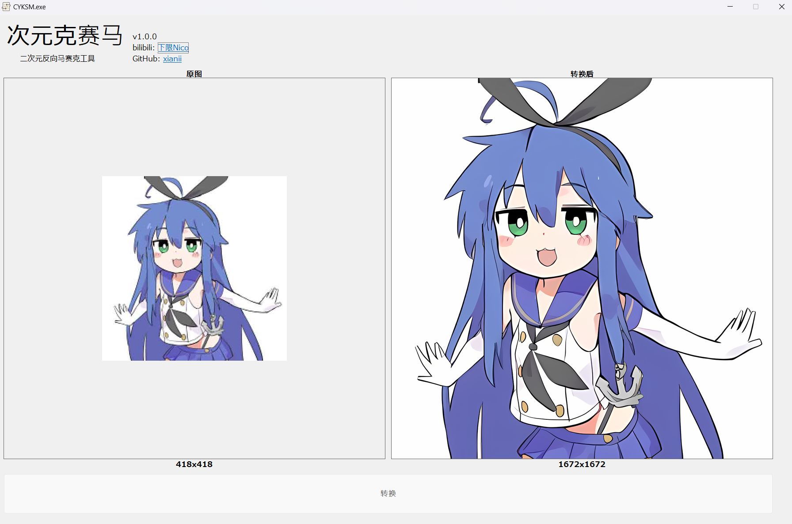

# 次元克赛马

A GUI for `realesrgan-x4plus-anime`  
一个`realesrgan-x4plus-anime`模型的简单图形界面。因为有着消除部分马赛克的能力，既然可以反马赛克，不如就叫做克赛马好了。

## Usage
将需要超分辨率的图片拖入左侧，点击按钮即可进行超分。处理后的图片将会保存在软件相同目录下。  
此模型适合处理小尺寸的二次元图片，对其他类型与大尺寸的图片可能效果不佳。并且尺寸过大可能会爆显存。

Drag the image that needs super-resolution into the left panel and click the button to perform the process. The processed image will be saved in the same directory as the software.  
This model is suitable for small-sized anime-style images and may not perform well on other types of images or large-sized pictures. Additionally, excessively large dimensions may cause VRAM overload.

## Info
This project is a AutoHotkey GUI for the `realesrgan-x4plus-anime` model in project [Real-ESRGAN](https://github.com/xinntao/Real-ESRGAN/)
